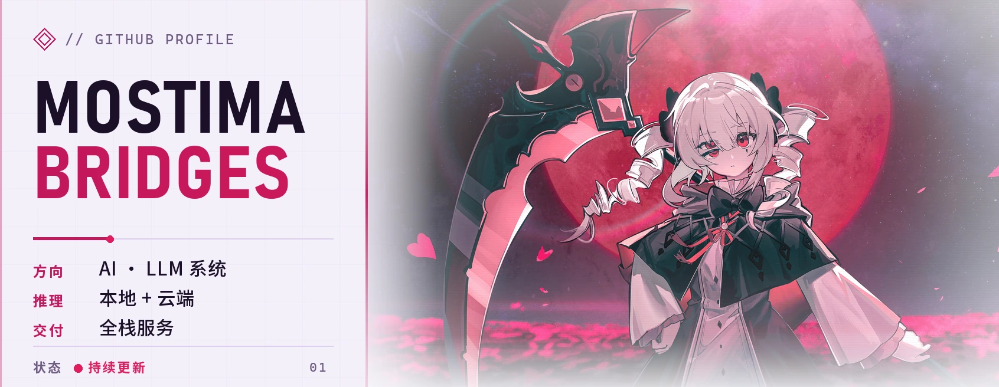
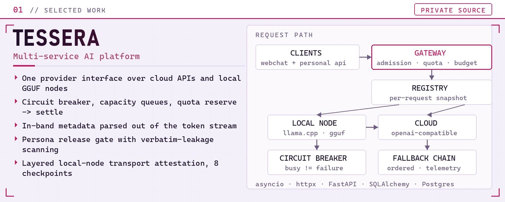
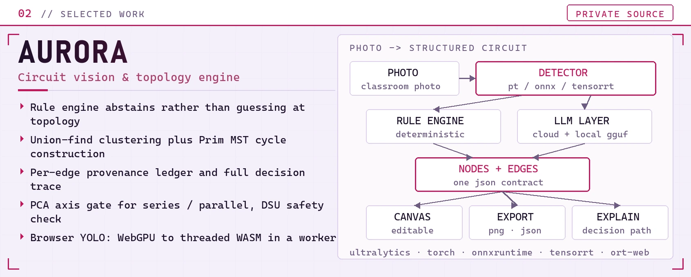
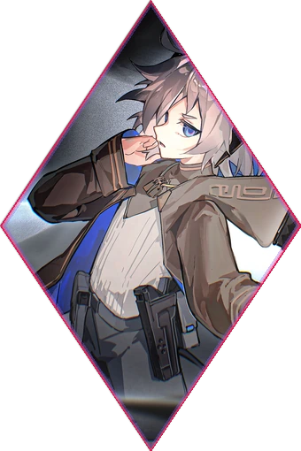

<!--
  MAINTAINING THIS FILE
  =====================
  * The two pills at the top and bottom are the only route between README.md
    (中文) and README.en.md. Keep the pair symmetric: check_readme.py fails if
    one page stops linking to the other.
  * Every image is self-hosted under assets/ except the typing subtitle and the
    two skillicons rows. If a third-party row disappears the page still reads,
    because the same stack is spelled out in prose right underneath.
  * dark / light switches with <picture> + prefers-color-scheme, and the plain
     fallback is always the LIGHT asset, so a client that ignores the media
    query does not paint a dark poster on a white page.
  * Never put a bare comma in a srcset: HTML reads it as a candidate separator
    and keeps only the first slice. skillicons takes its list as `?i=py,ts,js`,
    so the comma stays percent-encoded as %2C. check_readme.py enforces this.
  * Markdown inside 
 IS parsed by GitHub (a CommonMark HTML
    block ends at a blank line) — keep those blank lines.
  * The hero and project-card artwork is shared with README.md and its small HUD
    labels are Chinese. Headings, prose and alt text are not.
  * After editing: python scripts/check_readme.py   (CI runs the same script)
-->

<!-- ======================= LANGUAGE SWITCH / 语言切换 ======================= -->

  
  &nbsp;
  

<!-- ============================== HERO ============================== -->

<picture>
  <source media="(prefers-color-scheme: dark)" srcset="./assets/hero/hero-dark.webp" />
  <source media="(prefers-color-scheme: light)" srcset="./assets/hero/hero-light.webp" />
  
</picture>

**Strands** · [@MostimaBridges](https://github.com/MostimaBridges)

Mostly AI applications and local models; a few tools I needed every day ended up as things that actually run.

<picture>
  <source media="(prefers-color-scheme: dark)"
          srcset="https://readme-typing-svg.demolab.com?font=JetBrains+Mono&weight=500&size=19&duration=2600&pause=800&center=true&vCenter=true&width=900&height=46&color=FF4D7E&lines=Local+models+and+AI+apps%3BTurning+demos+into+systems+that+stay+up%3BNginx+%2B+Windows+%2B+CUDA+most+days%3BCircuit+recognition+and+multi-model+routing" />
  <source media="(prefers-color-scheme: light)"
          srcset="https://readme-typing-svg.demolab.com?font=JetBrains+Mono&weight=500&size=19&duration=2600&pause=800&center=true&vCenter=true&width=900&height=46&color=C2185B&lines=Local+models+and+AI+apps%3BTurning+demos+into+systems+that+stay+up%3BNginx+%2B+Windows+%2B+CUDA+most+days%3BCircuit+recognition+and+multi-model+routing" />
  
</picture>

<picture>
  <source media="(prefers-color-scheme: dark)" srcset="./assets/ornaments/divider-dark.webp" />
  <source media="(prefers-color-scheme: light)" srcset="./assets/ornaments/divider-light.webp" />
  
</picture>

<!-- ============================== ABOUT ============================== -->
## // ABOUT

Mostly AI applications. Cloud APIs and local GGUF models sit behind one interface, which means routing, fallback, streaming and quota control are all mine to write. Letting a model answer is the easy part; I care more about whether it is still up a week later.

There is also a circuit-recognition project: a photo goes in, a topology comes out, with a rule engine and an LLM each owning part of the path. I work on Windows day to day, but try to keep deployments runnable on Linux.

<picture>
  <source media="(prefers-color-scheme: dark)" srcset="./assets/ornaments/divider-dark.webp" />
  <source media="(prefers-color-scheme: light)" srcset="./assets/ornaments/divider-light.webp" />
  
</picture>

<!-- =============================== NOW =============================== -->
## // NOW

- **Multi-model serving** — provider config is editable from the admin panel and takes effect on the next request; when a local node is unreachable the request falls back to the cloud.
- **Local inference** — llama.cpp, GGUF, VRAM and RAM budgets, working out how to make it comfortable on the machine at home.
- **Circuit recognition** — turning a photo of a classroom circuit into a topology you can edit and validate. Detecting the parts is not the hard part; getting the wires right is.
- **Windows toolchain** — packaging, diagnostics and rollback scripts. PowerShell is still what I reach for most.

<picture>
  <source media="(prefers-color-scheme: dark)" srcset="./assets/ornaments/divider-dark.webp" />
  <source media="(prefers-color-scheme: light)" srcset="./assets/ornaments/divider-light.webp" />
  
</picture>

<!-- ============================== WORK ============================== -->
## // WORK

Both are private repositories, so the source is not something I can publish. This is only about how they are built.

<picture>
  <source media="(prefers-color-scheme: dark)" srcset="./assets/projects/tessera-dark.webp" />
  <source media="(prefers-color-scheme: light)" srcset="./assets/projects/tessera-light.webp" />
  
</picture>

#### TESSERA · multi-service AI platform `private`

It began as a front-end course assignment: static HTML plus jQuery, a lore wiki for a game, one page each for characters, items, worldbuilding and guides. The first commit message was literally “1”; the one that added lazy loading was “lazy loading aaaaaa”.

Every new entry meant editing HTML, so the data moved out. A backend arrived in March, two more sites were merged in as subdomains in April, and the AI layer only grew in August. The centre of the platform is now a hand-written LLM serving layer, and those first pages ended up as its shopfront — the front end is still plain JavaScript, with no framework and no bundler.

Changing a provider in the admin panel takes effect on the next request, with no restart. A few things that felt like a hassle at the time turned out to be worth keeping:

- Cloud and local models sit behind one streaming interface, and a request moves to the other side when one is unreachable
- The circuit breaker separates “busy” from “broken” — a queued node is not judged dead, only a real failure trips it
- Metadata mixed into the token stream is stripped as it arrives, so it never reaches the visible text or the stored history
- Daily quota is booked as reserve → settle, so a request that dies halfway cannot quietly eat the budget
- Character settings go through compile → publish → leakage check, with a gate before release
- A local inference node gets a layered check: listener, SSH, data plane, runtime, models, auth, gateway

<picture>
  <source media="(prefers-color-scheme: dark)" srcset="./assets/projects/aurora-dark.webp" />
  <source media="(prefers-color-scheme: light)" srcset="./assets/projects/aurora-light.webp" />
  
</picture>

#### AURORA · circuit recognition and topology recovery `private`

It started as an attempt to read classroom circuit diagrams. What became clear along the way is that detecting the components is not the hard part — reconstructing the wires into a topology you can trust is.

- With thin evidence it refuses to guess: it would rather return “unknown” than invent an edge that merely looks plausible
- Wires are clustered with union-find and loops are closed with a Prim MST, which keeps edges from flying across the graph
- Every edge records how it came to exist, so a wrong answer can be traced to the step that produced it
- YOLO runs in the browser itself, dropping from WebGPU to WASM when it has to

<picture>
  <source media="(prefers-color-scheme: dark)" srcset="./assets/ornaments/divider-dark.webp" />
  <source media="(prefers-color-scheme: light)" srcset="./assets/ornaments/divider-light.webp" />
  
</picture>

<!-- ============================== STACK ============================== -->
## // STACK

<picture>
  <source media="(prefers-color-scheme: dark)" srcset="https://skillicons.dev/icons?i=py%2Cts%2Cjs%2Cfastapi%2Cpostgres%2Csqlite%2Cnginx%2Cgit&theme=dark&perline=8" />
  <source media="(prefers-color-scheme: light)" srcset="https://skillicons.dev/icons?i=py%2Cts%2Cjs%2Cfastapi%2Cpostgres%2Csqlite%2Cnginx%2Cgit&theme=light&perline=8" />
  
</picture>

<picture>
  <source media="(prefers-color-scheme: dark)" srcset="https://skillicons.dev/icons?i=pytorch%2Copencv%2Cvue%2Cvite%2Clinux%2Cwindows%2Cpowershell%2Cgithub&theme=dark&perline=8" />
  <source media="(prefers-color-scheme: light)" srcset="https://skillicons.dev/icons?i=pytorch%2Copencv%2Cvue%2Cvite%2Clinux%2Cwindows%2Cpowershell%2Cgithub&theme=light&perline=8" />
  
</picture>

<picture>
  <source media="(prefers-color-scheme: dark)" srcset="./assets/icons/ai-tools-dark.svg" />
  <source media="(prefers-color-scheme: light)" srcset="./assets/icons/ai-tools-light.svg" />
  
</picture>

Python and plain JavaScript are the main tools; Vue and TypeScript are used on the online-course side. 
On the model side it is `llama.cpp` and GGUF; on the vision side, YOLO and `ONNX Runtime`. 
Deployment is mostly Nginx plus Windows services, with whatever can move to Linux moved.

Most of the code gets written inside Copilot and Codex; DSH and AstrBot are the agent projects I have been poking at lately.

<picture>
  <source media="(prefers-color-scheme: dark)" srcset="./assets/ornaments/divider-dark.webp" />
  <source media="(prefers-color-scheme: light)" srcset="./assets/ornaments/divider-light.webp" />
  
</picture>

<!-- =========================== CONTRIBUTIONS =========================== -->
## // Contributions

<picture>
  <source media="(prefers-color-scheme: dark)" srcset="./assets/generated/snake-dark.svg" />
  <source media="(prefers-color-scheme: light)" srcset="./assets/generated/snake-light.svg" />
  
</picture>

Rebuilt once a day by GitHub Actions — see [`.github/workflows/snake.yml`](.github/workflows/snake.yml).

<picture>
  <source media="(prefers-color-scheme: dark)" srcset="./assets/ornaments/divider-dark.webp" />
  <source media="(prefers-color-scheme: light)" srcset="./assets/ornaments/divider-light.webp" />
  
</picture>

<!-- ============================== NOTES ============================== -->
## // NOTES

Both projects above are private repositories, so only the approach is written down here.

The title card, project cards, dividers, monogram and the language pills are generated by <a href="./scripts/build_assets.py">scripts/build_assets.py</a>, so the palette is maintained in one place.

  
  &nbsp;
  

