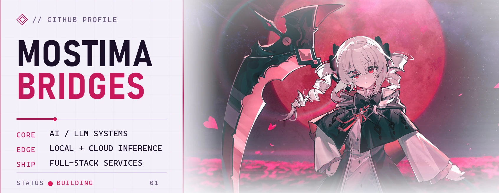
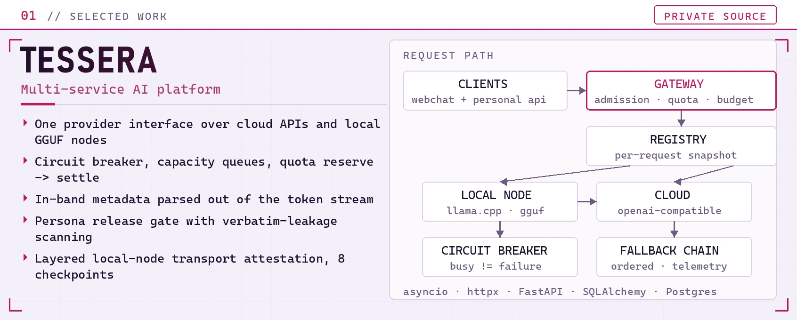
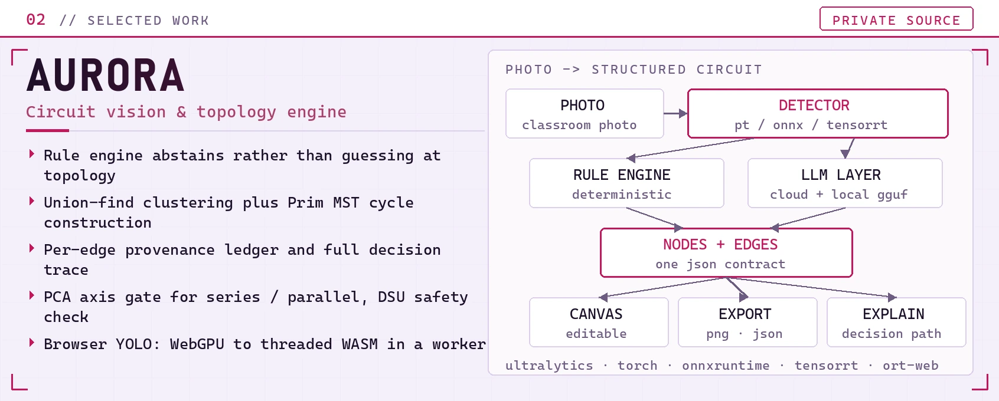
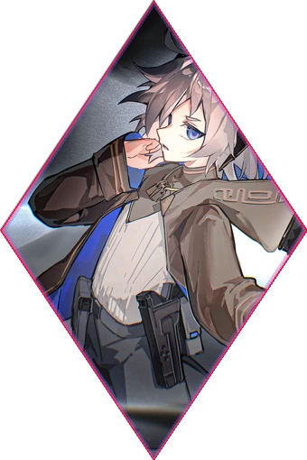

<!--
  维护说明
  ========
  * 图片全部放在 assets/ 下自己托管。只有 typing 副标题、Skill Icons 和徽章
    走第三方，它们挂掉不影响阅读。
  * dark / light 用 <picture> 切换，兜底的  一律指向 light 版本，
    这样不认 media query 的客户端也不会在浅色页面上出现一块黑图。
  * 
 里的 markdown 会被正常解析，那些空行别删。
  * 改完跑 python scripts/check_readme.py，这条也在 CI 里跑。
-->

<!-- ============================== HERO ============================== -->

<picture>
  <source media="(prefers-color-scheme: dark)" srcset="./assets/hero/hero-dark.webp" />
  <source media="(prefers-color-scheme: light)" srcset="./assets/hero/hero-light.webp" />
  
</picture>

**Strands** · [@MostimaBridges](https://github.com/MostimaBridges)

主要在做 AI 应用和本地模型，顺手把几个自己天天要用的东西做成了能跑起来的样子。

<picture>
  <source media="(prefers-color-scheme: dark)"
          srcset="https://readme-typing-svg.demolab.com?font=Noto+Sans+SC&weight=500&size=19&duration=2600&pause=800&center=true&vCenter=true&width=900&height=46&color=FF4D7E&lines=%E5%9C%A8%E6%8A%98%E8%85%BE%E6%9C%AC%E5%9C%B0%E6%A8%A1%E5%9E%8B%E5%92%8C%20AI%20%E5%BA%94%E7%94%A8%3B%E6%8A%8A%E8%83%BD%E8%B7%91%E7%9A%84%20Demo%20%E6%85%A2%E6%85%A2%E6%94%B9%E6%88%90%E7%9C%9F%E7%9A%84%E7%B3%BB%E7%BB%9F%3B%E7%BB%8F%E5%B8%B8%E5%92%8C%20Nginx%E3%80%81Windows%E3%80%81CUDA%20%E6%89%93%E4%BA%A4%E9%81%93%3B%E6%9C%80%E8%BF%91%E5%9C%A8%E7%9C%8B%E7%94%B5%E8%B7%AF%E8%AF%86%E5%88%AB%E5%92%8C%E5%A4%9A%E6%A8%A1%E5%9E%8B%E8%B7%AF%E7%94%B1" />
  <source media="(prefers-color-scheme: light)"
          srcset="https://readme-typing-svg.demolab.com?font=Noto+Sans+SC&weight=500&size=19&duration=2600&pause=800&center=true&vCenter=true&width=900&height=46&color=C2185B&lines=%E5%9C%A8%E6%8A%98%E8%85%BE%E6%9C%AC%E5%9C%B0%E6%A8%A1%E5%9E%8B%E5%92%8C%20AI%20%E5%BA%94%E7%94%A8%3B%E6%8A%8A%E8%83%BD%E8%B7%91%E7%9A%84%20Demo%20%E6%85%A2%E6%85%A2%E6%94%B9%E6%88%90%E7%9C%9F%E7%9A%84%E7%B3%BB%E7%BB%9F%3B%E7%BB%8F%E5%B8%B8%E5%92%8C%20Nginx%E3%80%81Windows%E3%80%81CUDA%20%E6%89%93%E4%BA%A4%E9%81%93%3B%E6%9C%80%E8%BF%91%E5%9C%A8%E7%9C%8B%E7%94%B5%E8%B7%AF%E8%AF%86%E5%88%AB%E5%92%8C%E5%A4%9A%E6%A8%A1%E5%9E%8B%E8%B7%AF%E7%94%B1" />
  
</picture>

<picture>
  <source media="(prefers-color-scheme: dark)" srcset="./assets/ornaments/divider-dark.webp" />
  <source media="(prefers-color-scheme: light)" srcset="./assets/ornaments/divider-light.webp" />
  
</picture>

<!-- ============================ 关于我 ============================ -->
## // 关于我

主要在做 AI 应用。云端 API 和本地 GGUF 模型走同一套接口，路由、回退、流式输出、额度控制这些都得自己写。
比起把模型调通，我更在意它跑起来之后稳不稳。

另外有一套电路识别的项目，从拍照到还原拓扑，规则引擎和 LLM 各管一段。
平时 Windows 上用得多，但部署尽量保持 Linux 也能跑。

<picture>
  <source media="(prefers-color-scheme: dark)" srcset="./assets/ornaments/divider-dark.webp" />
  <source media="(prefers-color-scheme: light)" srcset="./assets/ornaments/divider-light.webp" />
  
</picture>

<!-- ========================== 最近在折腾 ========================== -->
## // 最近在折腾

- **多模型服务** — 后台能改 provider 配置，下一次请求就生效；本地节点不通就自动切云端。
- **本地推理** — llama.cpp、GGUF、显存和内存占用，研究怎么在家里这台机器上跑得舒服一点。
- **电路识别** — 把课堂电路照片变成能编辑、能校验的拓扑图。认出元件不难，难的是把导线关系弄对。
- **Windows 工具链** — 打包、诊断、回滚脚本，用得最多的还是 PowerShell。

<picture>
  <source media="(prefers-color-scheme: dark)" srcset="./assets/ornaments/divider-dark.webp" />
  <source media="(prefers-color-scheme: light)" srcset="./assets/ornaments/divider-light.webp" />
  
</picture>

<!-- ============================= 项目 ============================= -->
## // 项目

两个都是私有仓库，源码不方便公开，这里只写做法。

<picture>
  <source media="(prefers-color-scheme: dark)" srcset="./assets/projects/tessera-dark.webp" />
  <source media="(prefers-color-scheme: light)" srcset="./assets/projects/tessera-light.webp" />
  
</picture>

#### TESSERA · 多服务 AI 平台 `私有`

三个 FastAPI 服务放在一个反向代理后面，核心是自己写的一套 LLM 服务层。
后台改完 provider 配置，下一次请求就生效，不用重启。

- 云端和本地模型走同一套流式接口，一边不通就换另一边
- 熔断器把「忙」和「坏」分开看，节点排队时不会直接判死
- 流式返回里混着的元数据会在输出过程中剥掉，不污染正文和历史
- 角色设定走编译 → 发布 → 泄漏检查，发布前会拦一道

<picture>
  <source media="(prefers-color-scheme: dark)" srcset="./assets/projects/aurora-dark.webp" />
  <source media="(prefers-color-scheme: light)" srcset="./assets/projects/aurora-light.webp" />
  
</picture>

#### AURORA · 电路识别与拓扑还原 `私有`

一开始只是想把课堂电路图识别出来。做下去才发现，认出元件不难，
难的是把导线关系还原成一张靠谱的拓扑图。

- 证据不够就不猜。宁可返回「未知」，也不编一条看起来合理的边
- 导线用并查集聚类，环路用 Prim MST 收，避免连线在图上乱飞
- 每条边都记着自己是怎么来的，答错了能查到是哪一步
- 浏览器里直接跑 YOLO，WebGPU 不行就退到 WASM

<picture>
  <source media="(prefers-color-scheme: dark)" srcset="./assets/ornaments/divider-dark.webp" />
  <source media="(prefers-color-scheme: light)" srcset="./assets/ornaments/divider-light.webp" />
  
</picture>

<!-- =========================== 常用技术 =========================== -->
## // 常用技术

<picture>
  <source media="(prefers-color-scheme: dark)" srcset="https://skillicons.dev/icons?i=py,ts,js,fastapi,postgres,sqlite,nginx&theme=dark&perline=7" />
  <source media="(prefers-color-scheme: light)" srcset="https://skillicons.dev/icons?i=py,ts,js,fastapi,postgres,sqlite,nginx&theme=light&perline=7" />
  
</picture>

<picture>
  <source media="(prefers-color-scheme: dark)" srcset="https://skillicons.dev/icons?i=pytorch,opencv,vue,vite,linux,windows,powershell&theme=dark&perline=7" />
  <source media="(prefers-color-scheme: light)" srcset="https://skillicons.dev/icons?i=pytorch,opencv,vue,vite,linux,windows,powershell&theme=light&perline=7" />
  
</picture>

- **AI / LLM** — `Python` · `FastAPI` · `llama.cpp` · `GGUF` · SSE 流式
- **前端** — `JavaScript` · `TypeScript` · `Vue` · Canvas
- **视觉 / 模型** — `YOLO` · `PyTorch` · `ONNX Runtime` · `OpenCV`
- **数据 / 基建** — `PostgreSQL` · `SQLite` · `Nginx` · `PowerShell` · `Linux`

写顺手的是 Python 和原生 JS，Vue 和 TypeScript 用在在线课程那套上。
部署基本是 Nginx 加 Windows 服务，能搬去 Linux 的尽量搬。

<picture>
  <source media="(prefers-color-scheme: dark)" srcset="./assets/ornaments/divider-dark.webp" />
  <source media="(prefers-color-scheme: light)" srcset="./assets/ornaments/divider-light.webp" />
  
</picture>

<!-- ========================= Contributions ========================= -->
## // Contributions

<picture>
  <source media="(prefers-color-scheme: dark)" srcset="./assets/generated/snake-dark.svg" />
  <source media="(prefers-color-scheme: light)" srcset="./assets/generated/snake-light.svg" />
  
</picture>

每天由 GitHub Actions 重新生成，见 [`.github/workflows/snake.yml`](.github/workflows/snake.yml)。

<picture>
  <source media="(prefers-color-scheme: dark)" srcset="./assets/ornaments/divider-dark.webp" />
  <source media="(prefers-color-scheme: light)" srcset="./assets/ornaments/divider-light.webp" />
  
</picture>

<!-- ============================ 找到我 ============================ -->
## // 找到我

两个项目都是私有仓库，源码不方便公开。想聊多模型服务、本地推理，
或者视觉加规则这类东西，在 GitHub 上找我就行。

标题图、项目卡、分隔线和 monogram 都由 <a href="./scripts/build_assets.py">scripts/build_assets.py</a> 生成，配色只维护那一处。
